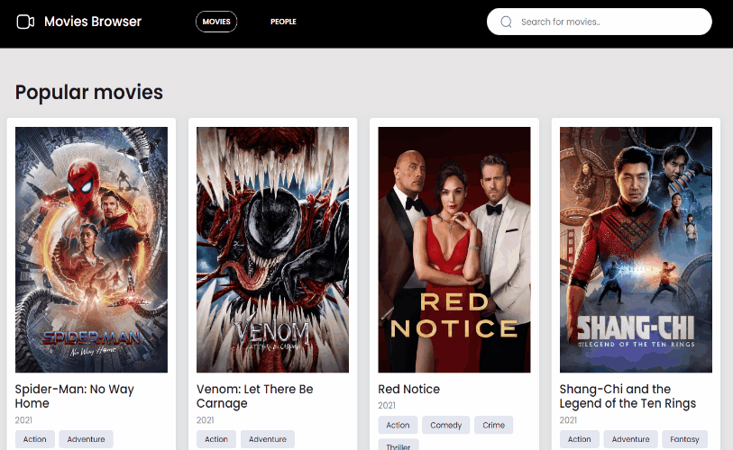

# &#127916; Group project : Movies Browser

# 👨‍💻 Authors :

Przemek Przybalak : <a href="https://github.com/Przemek-Przybylak">GitHub</a>

Piotrek Brzegowy : <a href="https://github.com/piotrekbrzegowy">GitHub</a>

Dominik Blak : <a href="https://github.com/dominikblak">GitHub</a>

## 📖 Description :

Application with the current database and search engine for movies and actors.
In "Movies" section you will find information about movies such as: title, release date, genres, rating, number of votes, description of the movie.In the "people" section you will find information on actors such as: date and place of birth and their biography, and a list of productions in which the actor participated.The data comes from the TMDB API.

### 🚀 Demo :

<a href="https://dominikblak.github.io/movies-browser/">Movies Browser</a>

#### ℹ️ Instruction :

- Browse the currently popular movies. You'll find a description of the film and its genre, country of production, release date, viewers' ratings, cast and crew.

- Browse currently popular actors. You will find here information about a given actor, such as: date of birth, short biography, list of films in which he participated as an actor or a co-creator.

- Ability to search for movies and actors.

#### 🧰 Technology

- HTML
- CSS
- React JS
- Styled-components
- Flex
- Grid
- Media queries
- Creat-react-app
- React - Redux
- React - Toolkit
- Redux Saga
- Redux Router
- Axios
- Custom Hooks
- GIT
- githubPages
- Scrum

# Getting Started with Create React App

This project was bootstrapped with [Create React App](https://github.com/facebook/create-react-app).

## Available Scripts

In the project directory, you can run:

### `npm start`

Runs the app in the development mode.\
Open [http://localhost:3000](http://localhost:3000) to view it in the browser.

The page will reload if you make edits.\
You will also see any lint errors in the console.

### `npm run build`

Builds the app for production to the `build` folder.\
It correctly bundles React in production mode and optimizes the build for the best performance.

The build is minified and the filenames include the hashes.\
Your app is ready to be deployed!

See the section about [deployment](https://facebook.github.io/create-react-app/docs/deployment) for more information.

### `npm run eject`

**Note: this is a one-way operation. Once you `eject`, you can’t go back!**

If you aren’t satisfied with the build tool and configuration choices, you can `eject` at any time. This command will remove the single build dependency from your project.

Instead, it will copy all the configuration files and the transitive dependencies (webpack, Babel, ESLint, etc) right into your project so you have full control over them. All of the commands except `eject` will still work, but they will point to the copied scripts so you can tweak them. At this point you’re on your own.

You don’t have to ever use `eject`. The curated feature set is suitable for small and middle deployments, and you shouldn’t feel obligated to use this feature. However we understand that this tool wouldn’t be useful if you couldn’t customize it when you are ready for it.
